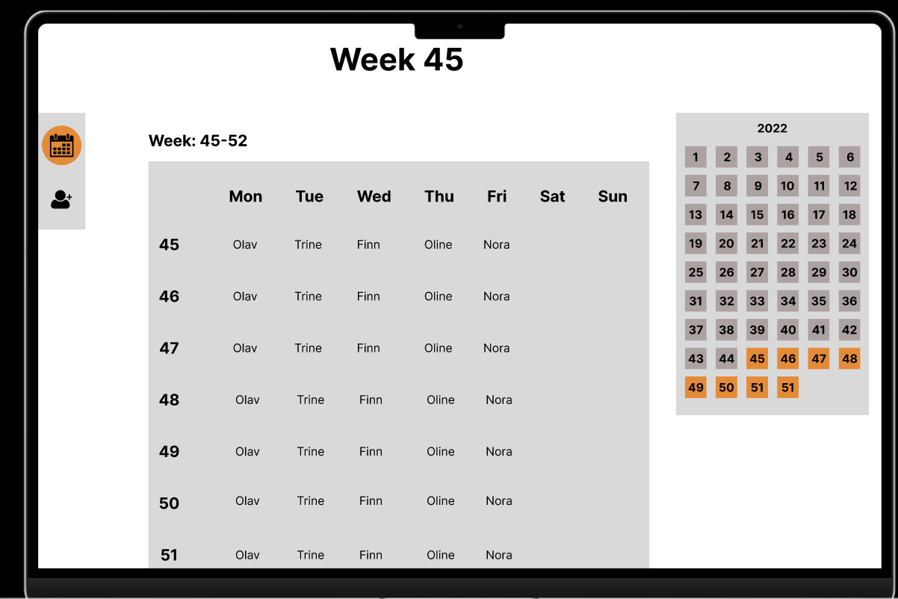
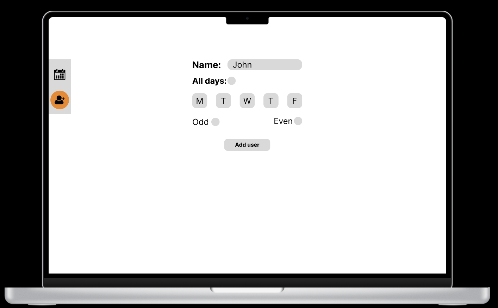

# 1. Skal dokumentere hvilke api-endepunkter (ressurser) som skal brukes #
**EMPLOYEES**
- api/employees/  
  → api/employees/[id]  
  → api/employees/create  
  → api/employees/name/[name]  

**WEEKS**
- api/weeks/  
  → api/weeks/[id]  
  → api/weeks/range

**YEARS**
- api/years/  

**OVERWRITES**
- api/overwrites/  

**REPORT**
- api/report/  

# 2. Skal til hvert api-endepunkt dokumentere hvilke verb som er tilgjengelig. Hva slags forespørsler skal de håndtere. #
**EMPLOYEES**
- ***api/employees***  
→ [‘GET’]

- ***api/employees/[id]***  
→ [‘GET’, ‘PUT’]

- ***api/employees/create***  
→ [‘POST’]

- ***api/employees/name/[name]***  
→ [‘GET’]

**WEEKS**
- ***api/weeks/***  
→ [‘GET’]

- ***api/weeks/[id]***  
→ [‘GET’]

- ***api/weeks/range***  
→ [‘GET’]

**YEARS**
- ***api/years***  
→ [‘GET’]

**OVERWRITES**
- ***api/overwrites***  
→ [‘GET’, 'POST'] 

**REPORT**
- ***api/report***  
→ [‘GET’] 

# 3. Skal til hvert api-endepunkt dokumentere responsen og statuskoden for de ulike verbene. Hva slags data skal returneres når det går riktig / feil. #
**EMPLOYEES**
- ***api/employees/***  
*Happy-path*  
→ ‘GET’: *“ status: 200, data: employees ”*    
*Unhappy-path*  
→ ‘GET’: *“ status: 500, error: 'Failed getting employees' ”*  

- ***api/employees/[id]***  
*Happy-path*  
→ ‘GET’: *“ status: 200, data: employee ”*  
→ ‘PUT’: *“ status: 200, data: updatedEmployee*   
*Unhappy-path*  
→ ‘GET’: *“ status: 400, error: 'Id is missing' ”*  
→ ‘GET’: *“ status: 404, error: 'Employee not found' ”*   
→ ‘PUT’: *“ status: 400, error: 'Id not found'* 
→ ‘PUT’: *“ status: 400, error: 'Missing data'* 
→ ‘PUT’: *“ status: 500, error: 'Failed updating employee by URL'* 

- ***api/employees/create***  
*Happy-path*  
→ ‘POST’: *“ status: 201, data: createdEmployee*   
*Unhappy-path*  
→ ‘POST’: *“ status: 400, error: 'Missing required fields: employeeNum, name, rules'* 
→ ‘POST’: *“ status: 409, error: 'Employee already exists'* 
→ ‘POST’: *“ status: 500, error: 'Failed creating employee'* 

- ***api/employees/name/[name]***  
*Happy-path*  
→ ‘GET’: *“ status: 200, data: employee*   
*Unhappy-path*  
→ ‘GET’: *“ status: 400, error: 'Id is missing' ”*  
→ ‘GET’: *“ status: 404, error: 'Employee not found' ”*  

**WEEKS**
- ***api/weeks/***  
*Happy-path*  
→ ‘GET’: *“ status: 200, data: weeks ”*    
*Unhappy-path*  
→ ‘GET’: *“ status: 500, error: 'Failed getting weeks' ”*  

- ***api/weeks/[id]***  
*Happy-path*  
→ ‘GET’: *“ status: 200, data: week ”*    
*Unhappy-path*  
→ ‘GET’: *“ status: 400, error: 'Id is missing' ”*  
→ ‘GET’: *“ status: 404, error: 'Week not found' ”*  

- ***api/weeks/range***  
*Happy-path*  
→ ‘GET’: *“ status: 200, data: weeks ”*    
*Unhappy-path*  
→ ‘GET’: *“ status: 400, error: 'Query parameters are missing' ”*  
→ ‘GET’: *“ status: 403, error: 'Invalid query parameters' ”*  
→ ‘GET’: *“ status: 500, error: 'Failed getting weeks by query parameters' ”*  

**YEARS**
- ***api/years***  
*Happy-path*  
→ ‘GET’: *“ status: 200, data: years ”*    
*Unhappy-path*  
→ ‘GET’: *“ status: 500, error: 'Failed getting years' ”*  

**OVERWRITES**
- ***api/overwrites***  
*Happy-path*  
→ ‘GET’: *“ status: 200, data: overwrites ”*  
→ ‘POST’: *“ status: 201, data: createdOverwrite ”*    
*Unhappy-path*  
→ ‘GET’: *“ status: 500, error: 'Failed getting overwrites' ”*  
→ POST: *“ status: 400, error: 'Missing required fields: dayId, employeeNum' ”*  
→ POST: *“ status: 500, error: 'Failed creating an overwrite' ”*  

**REPORT**  
- ***api/report***  
*Happy-path*  
→ ‘GET’: *“ status: 200 ”*    
*Unhappy-path*  
→ ‘GET’: *“ status: 500, error: 'Failed downloading report' ”*  

**ERROR**  
- ***FELLES ERROR***  
→ ‘ERROR 405’: *“ status: 405, data: ' Method not allowed ' ”*  

# 4. Skal dokumentere hvilke sider (urler) som skal benytte de ulike APIene og grovt hva som kan gjøres på den enkelte siden. Hvilke sider i "pages" skal opprettes og grovt hva som kan gjøres på de ulike sidene. Kan vurdere å lage en helt enkel low-fi designskisse eller forklare kort hva brukerne skal kunne gjøre på side X, Y og Z samt hvilket api-endepunkt som benyttes. #
## <ins> Forside </ins> ##
- Vise hele året  
→ Page: */index*  
→ API: */api/years*  
→ API: */api/weeks*  
→ API: */api/weeks/range*  

## <ins> Ikke forside </ins> ##
- Vise hvem som har ansvaret for en gitt uke  
→ Page: */weeks/[id]*  
→ API: */api/weeks/[id]*  

- Vise dager en gitt person har ansvaret for  
→ Page: */employees/[id]*  
→ API: */api/employees/[id]*  

- Opprette en bruker  
→ Page: */employees/create*  
→ API: */api/employees/create*  

- Opprette navn på en bruker  
→ Page: */employees/[id]/update*  
→ API: */api/employees/[id]*  

- Laste ned lunsjlisten i Excel-format   
→ Page: */index*  
→ API: */api/report*  

- Lage overskrivelser   
→ Page: */weeks/[id]/overwrites*  
→ API: */api/overwrite*  

## <ins> Kan gjøres på forsiden </ins> ##
- Vise hvem som har ansvaret for en gitt periode (uke 2-6)   
→ Page: */index*  
→ API: */api/weeks*  
→ API: */api/weeks/range*  
→ Beskrivelse: *eget API-kall som tar imot start- og slutt-nummer som parametere og returnerer tilsvarende uker*  

- Kunne søke etter et gitt navn   
→ Page: */index*  
→ API: */api/employees/name/[name]*  
→ Beskrivelse: *hente ansatt ved å bruke navnet, sende deretter videre til /employee/[id]*  

## <ins> Figma skisser: </ins> ##
* Page: /index  

* Page: /employees/create  

## <ins> Oppgave 3.5.2: </ins> ##